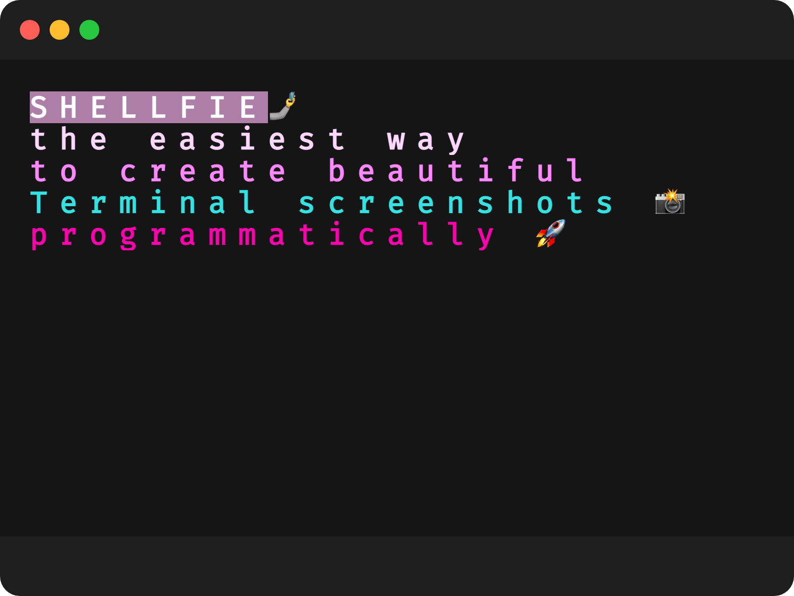
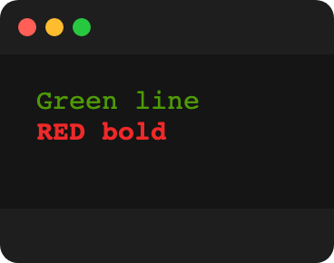
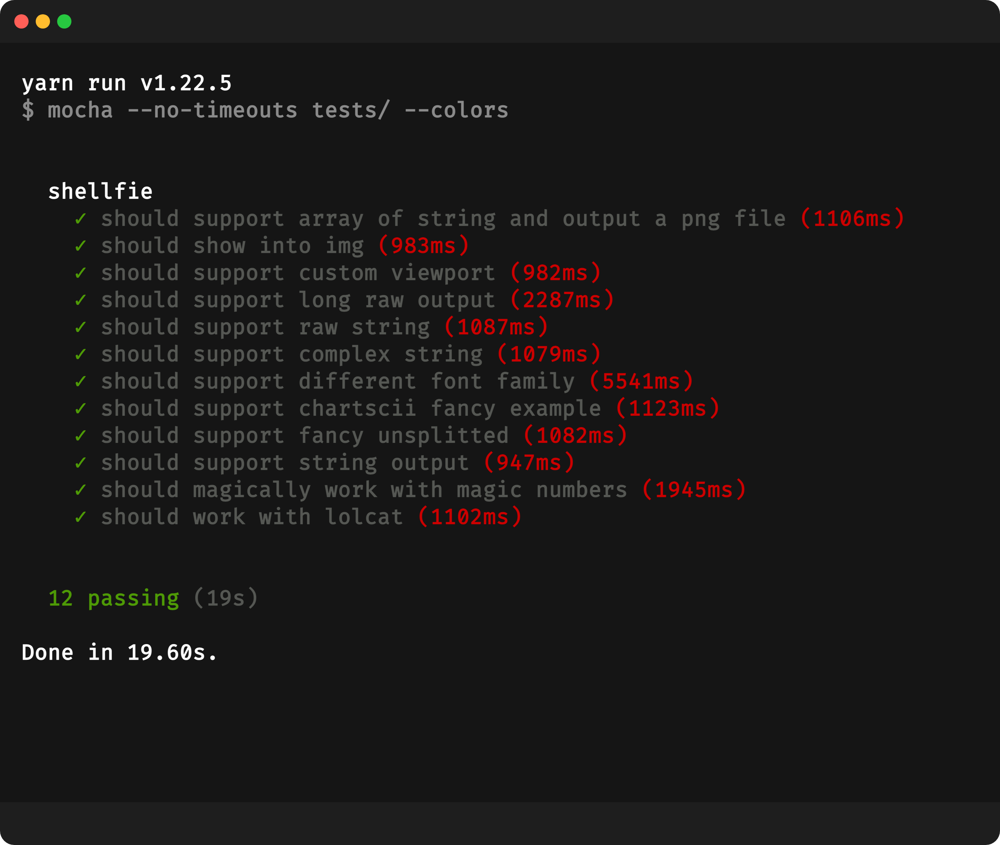

# shellfie 🤳🏽

create beautiful terminal screenshots from formatted string

# install
```bash
yarn add shellfie
```

# the holy trinity ▽
`shellfie` respects the holy trinity: the lib, the service, and the cli.   
  - [shellfie](https://github.com/tool3/shellfie)   
  - [shellfied](https://github.com/tool3/shellfied)   
  - [shellfie-cli](https://github.com/tool3/shellfie-cli)   

# usage
```js
const data = [
    '\x1b[105mSHELLFIE\\x1b[0m🤳',
    '\x1b[38;5;225mthe easiest way',
    '\x1b[38;5;213mto create beautiful',
    '\x1b[38;5;14mCLI screenshots 📸',
    '\x1b[38;5;199mprogrammatically 🚀'
];
const options = {
    name: 'shellfie',
    style: {
        fontSize: 15,
        fontWeight: 'bold',
        fontFamily: 'Fira Code'
    },
    viewport: {
        width: 400,
        height: 300
    }
}
await shellfie(data, options);
```

outputs:   



# data
**type**: `string[]` || `string`   
**description**: string data to output to the terminal

# options
**type**: `object`   
**description**: optional config for `shellfie`
### `name`
**type**: `string`   
**description**: name of image   
### `location`
**type**: `string`   
**description**: relative path to save your shellfies   
### `puppeteerArgs`
**type**: `string[]`   
**description**: optional puppteer args    
**default**: `['--no-sandbox', '--disable-setuid-sandbox']`
### `mode`
**type**: `string`   
**description**: can allow raw string input. for example: `yarn test --colors > help.txt`, then copy the text and provide it to `shellfie` with this option set to `raw`.   
**default**: `default`
### `theme`
**type**: `object`   
**description**: optional theme style
- #### `background`
  **type**: `string`   
  **description**: css color for terminal background   
  **default**: `'#151515'`
- #### `forground`
  **type**: `string`   
  **description**: css color for any unformatted string provided in `data`
### `style`
  **type**: `object`   
  **description**: css properties for terminal output
- #### `fontSize`
  **type**: `number`   
  **description**: font size
- #### `fontWeight`
  **type**: `string`   
  **description**: font weight
- #### `fontFamily`
  **type**: `string`   
  **description**: font family
### `viewport`
**type**: `object`   
**description**: viewport of terminal   
**default**: `{ width: 700, height: 600 }`
- #### `width`
  **type**: `number`   
  **description**: viewport width
- #### `height`
  **type**: `number`   
  **description**: viewport height

  # examples
  ```js
  await shellfie(["\x1b[32mGreen line", "\x1b[31;1mRED bold"], { name: 'small', viewport: { width: 200, height: 200 } });
  ```   

   


```js
const testResults = [
    "yarn run v1.22.5",
    "$ mocha --no-timeouts tests/ --colors",
    "",
    "",
    "  shellfie",
    "    ✓ should support array of string and output a png file (1106ms)",
    "    ✓ should show into img (983ms)",
    "    ✓ should support custom viewport (982ms)",
    "    ✓ should support long raw output (2287ms)",
    "    ✓ should support raw string (1087ms)",
    "    ✓ should support complex string (1079ms)",
    "    ✓ should support different font family (5541ms)",
    "    ✓ should support chartscii fancy example (1123ms)",
    "    ✓ should support fancy unsplitted (1082ms)",
    "    ✓ should support string output (947ms)",
    "    ✓ should magically work with magic numbers (1945ms)",
    "    ✓ should work with lolcat (1102ms)",
    "",
    "",
    "  12 passing (19s)",
    "",
    "Done in 19.60s.",
];
await shellfie(testResults, { name: 'fira', style: { fontFamily: 'Fira Code', fontWeight: 'bold' } });
```   


