# shellfie

Take a shell selfie.  
Your terminal output deserves better than a blurry screenshot.

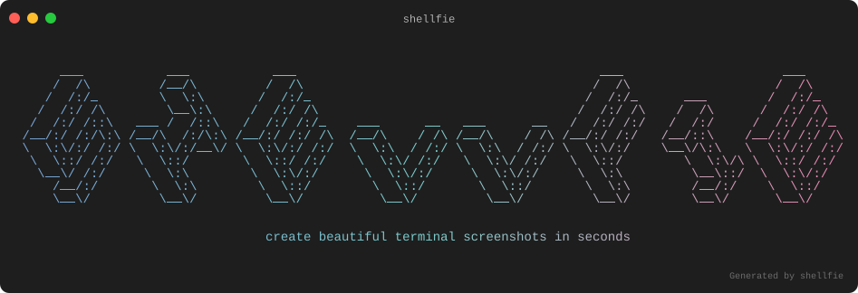

| Feature             | shellfie | carbon-now-cli | svg-term | termtosvg |
| ------------------- | -------- | -------------- | -------- | --------- |
| Zero dependencies   | ✅       | ❌             | ❌       | ❌        |
| No native bindings  | ✅       | ❌             | ❌       | ❌        |
| No headless browser | ✅       | ❌             | ✅       | ✅        |
| Full ANSI support   | ✅       | ✅             | ✅       | ✅        |
| 24-bit true color   | ✅       | ✅             | ❌       | ✅        |
| Runs in browser     | ✅       | ❌             | ❌       | ❌        |
| Synchronous API     | ✅       | ❌             | ❌       | ❌        |

```typescript
import { execSync } from "child_process";
import shellfie from 'shellfie'

const log = execSync("git log --oneline --graph --color=always").toString();
const svg = shellfie(log, { title: "git log" });
```

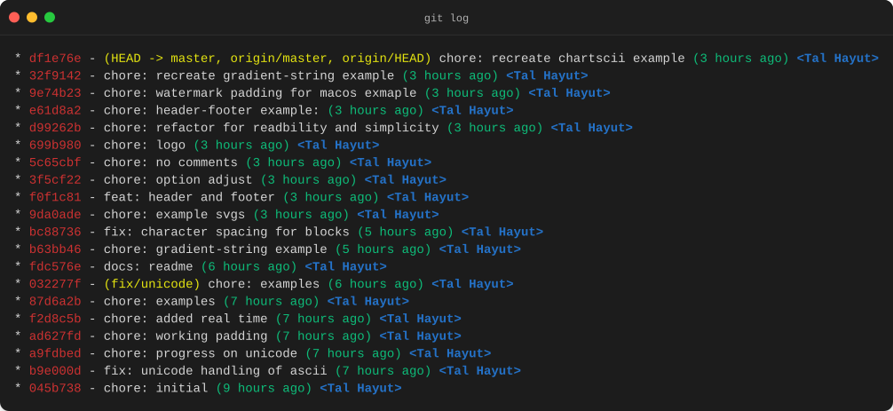

## Why SVG?

✅ **Infinitely scalable** — pixel-perfect at any zoom level, retina-ready by default.  
✅ **Selectable text** — copy code directly from the image.  
✅ **Embeddable everywhere** — high quality embedding in READMEs, docs, blogs, everywhere.  
✅ **Tiny files** — 2-10KB vs blurry 500KB+ PNGs.   
✅ **No rendering pipeline** — runs anywhere JavaScript runs.   

## Install

```bash
npm install shellfie
```

## Usage

```typescript
import shellfie from "shellfie";

const svg = shellfie(terminalOutput, {
  template: "macos",
  title: "npm test",
});
```

## Browser

```html
<script type="module">
  import shellfie from "https://esm.sh/shellfie";

  const svg = shellfie("\x1b[32m$ npm test\x1b[0m\nAll tests passed!", {
    template: "macos",
    title: "terminal",
  });

  document.body.innerHTML = svg;
</script>
```

## Templates

| macOS                             | Windows                               | Minimal                               |
| --------------------------------- | ------------------------------------- | ------------------------------------- |
|  |  |  |

```typescript
shellfie(output, { template: "macos" }); // default
shellfie(output, { template: "windows" });
shellfie(output, { template: "minimal" });
```

## Options

```typescript
shellfie(input, {
  template?: "macos",                             // 'macos' | 'windows' | 'minimal' | Template
  title?: "my-terminal",                          // window title
  width?: 80,                                     // terminal columns (auto-detected if not set)
  padding?: 16,                                   // number | [v, h] | [top, right, bottom, left]
  controls?: true,                                // show window control buttons
  fontSize?: 14,                                  // font size in pixels
  lineHeight?: 1.4,                               // line height multiplier
  fontFamily?: "'SF Mono', Monaco, monospace",    // font stack
  customGlyphs?: true,                            // pixel-perfect box drawing characters
  embedFont?: true,                               // embed default font as base64 (async only)
  customFont?: {                                  // use your own font
    data: base64FontData,                         //   base64-encoded font data
    format: "woff2",                              //   'woff2' | 'woff' | 'ttf'
  },
  theme?: customTheme,                            // custom color theme or see themes below
  watermark?: "Generated by shellfie",            // bottom-right text (supports ANSI)
  watermarkPadding?: 16,                          // number | [v, h] | [top, right, bottom, left]
  header?: {                                      // header configuration
    backgroundColor?: "#2d2d2d",                  //   title bar background color
    height?: 40,                                  //   title bar height in pixels
    border?: true,                                //   show bottom border
    borderColor?: "#1a1a1a",                      //   border color
    borderWidth?: 1,                              //   border width in pixels
  },
  footer?: {                                      // footer configuration
    backgroundColor?: "#2d2d2d",                  //   footer background color
    height?: 30,                                  //   footer height in pixels
    border?: true,                                //   show top border
    borderColor?: "#1a1a1a",                      //   border color
    borderWidth?: 1,                              //   border width in pixels
  },
});
```

## Font Embedding

For portable SVGs that render identically everywhere:

```typescript
import { shellfieAsync } from "shellfie";

const svg = await shellfieAsync(input, { embedFont: true });
```

The font gets base64-encoded directly into the SVG. No external requests, no CORS issues, no "why does this look different on their machine" debugging sessions.

## Themes

shellfie comes with 12 built-in themes:

```typescript
import shellfie, { dracula, nord, tokyoNight } from "shellfie";

shellfie(output, { theme: dracula });
```

| Dracula                                      | Nord                                   | Tokyo Night                                          |
| -------------------------------------------- | -------------------------------------- | ---------------------------------------------------- |
| 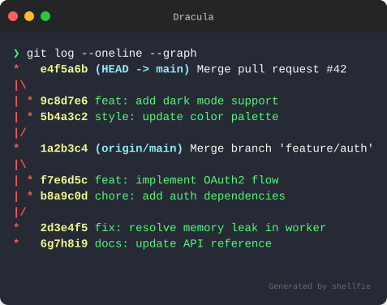 | 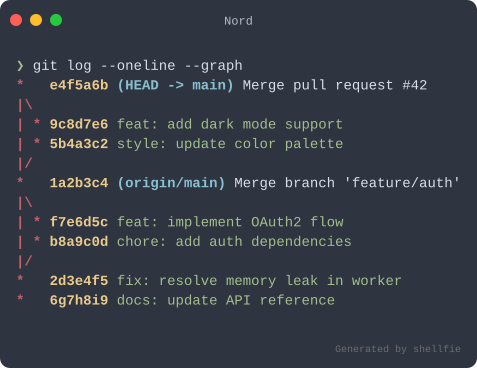 | 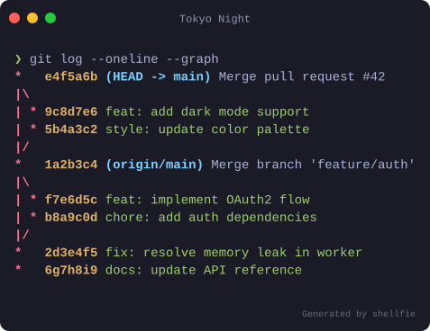 |

| One Dark                                       | Monokai                                      | Catppuccin Mocha                                               |
| ---------------------------------------------- | -------------------------------------------- | -------------------------------------------------------------- |
| 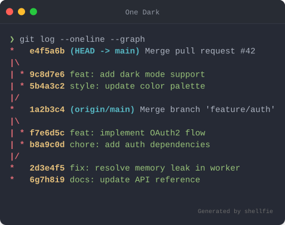 | 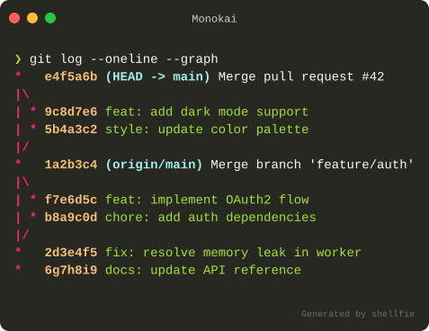 | 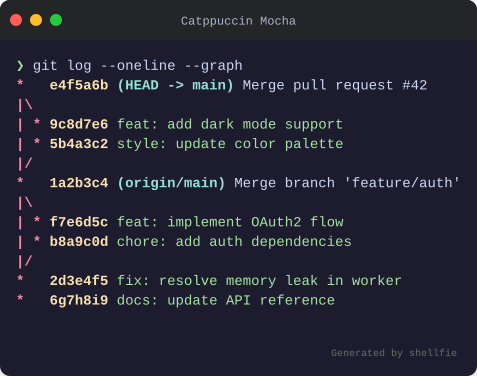 |

| GitHub Dark                                          | GitHub Light                                           | Gruvbox Dark                                           |
| ---------------------------------------------------- | ------------------------------------------------------ | ------------------------------------------------------ |
| 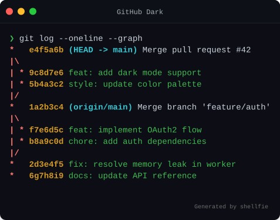 | 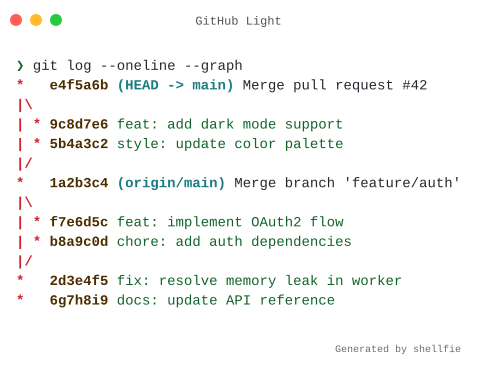 | 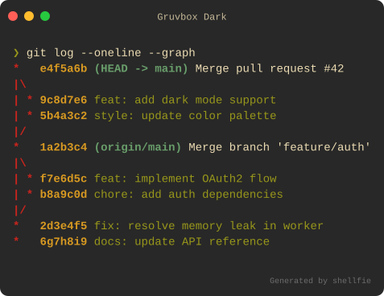 |

| Gruvbox Light                                            | Solarized Dark                                             | Solarized Light                                              |
| -------------------------------------------------------- | ---------------------------------------------------------- | ------------------------------------------------------------ |
| 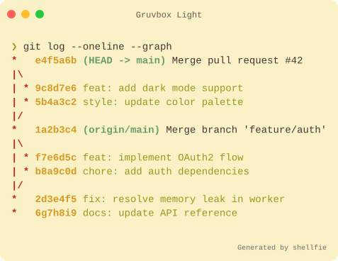 | 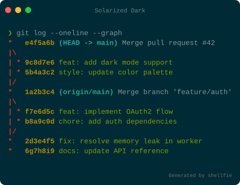 | 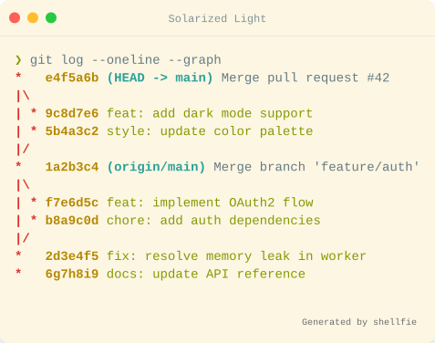 |

## Custom Themes

```typescript
import shellfie, { createTheme } from "shellfie";

const theme = createTheme({
  name: "ocean",
  background: "#0a2540",
  foreground: "#e6f1ff",
  red: "#ff6b6b",
  green: "#69db7c",
  // ... all 16 ANSI colors
});

shellfie(output, { theme });
```

## Full Color Support

### 24-bit True Color & 256-color palette

```typescript
import gradient from "gradient-string";
import shellfie from "shellfie";

const svg = shellfie(gradient.rainbow("Hello World"), {
  template: "macos",
  title: "gradient string",
});
```

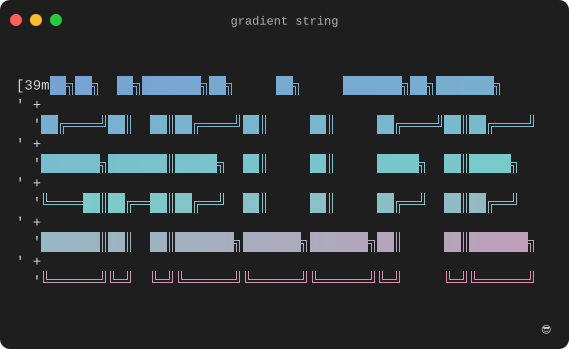

### Works with any ANSI output

```typescript
import Chartscii from "chartscii";
import shellfie from "shellfie";

const chart = new Chartscii(data, {
  barSize: 2,
  fill: "▒",
  colorLabels: true,
  orientation: "vertical",
  valueLabels: true,
});

const svg = shellfie(chart.create(), {
  template: "macos",
  title: "Chartscii",
  padding: 50,
});
```

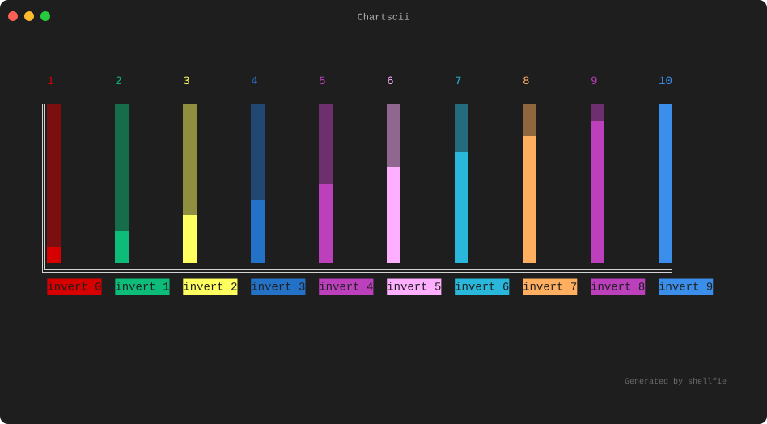

### CLI tools, test runners, anything

```typescript
shellfie(execSync("git diff --color=always").toString());
shellfie(execSync("npm test 2>&1").toString());
shellfie(execSync("ls -la --color=always").toString());
```

## Utilities

```typescript
import { parse, render, stripAnsi, getMaxWidth } from "shellfie";

const lines = parse("\x1b[31mred\x1b[0m text");
const svg = render(lines, options);

stripAnsi("\x1b[31mred\x1b[0m"); // 'red'
getMaxWidth(lines); // 80
```

## License

MIT — do whatever you want with it. If you build something cool, I'd love to see it.
