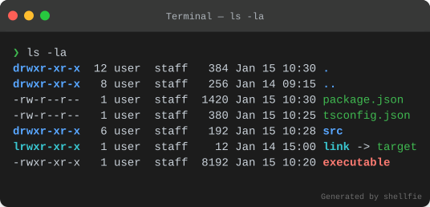
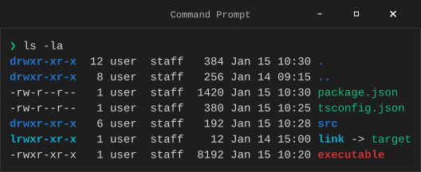
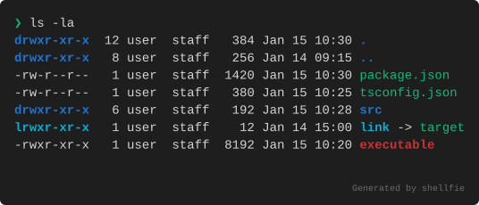
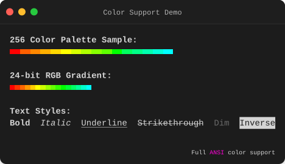
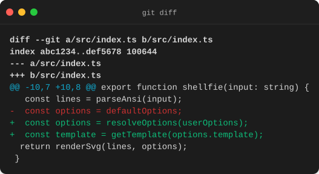
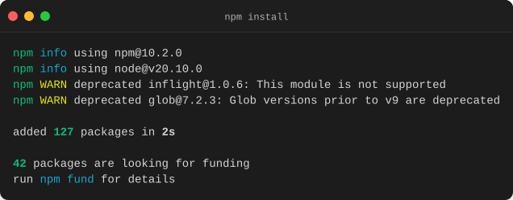

# snaptty

Convert terminal output to crystal-clear SVG images.

```typescript
import { snaptty } from 'snaptty';

const svg = snaptty('\x1b[32m✓\x1b[0m All tests passed');
```



## Features

- **Full ANSI color support** — 16 colors, 256 colors, and 24-bit RGB
- **Text styling** — bold, italic, underline, strikethrough, dim, inverse
- **Beautiful templates** — macOS, Windows, or minimal chrome
- **Zero dependencies** — lightweight and fast
- **Cross-platform** — works on macOS, Linux, and Windows
- **TypeScript first** — full type definitions included
- **Portable SVGs** — optional font embedding for perfect rendering anywhere

## Installation

```bash
npm install snaptty
```

## Quick Start

```typescript
import { snaptty } from 'snaptty';
import { writeFileSync } from 'fs';

// Capture any terminal output
const terminalOutput = `\x1b[1;32m❯\x1b[0m npm test

\x1b[32m✓\x1b[0m 73 tests passed
\x1b[2mRan in 238ms\x1b[0m`;

// Convert to SVG
const svg = snaptty(terminalOutput, {
  title: 'npm test',
  template: 'macos'
});

writeFileSync('output.svg', svg);
```

## Templates

### macOS (default)

Classic macOS terminal with traffic light buttons.

```typescript
snaptty(output, { template: 'macos' });
```


### Windows

Windows terminal style with square controls.

```typescript
snaptty(output, { template: 'windows' });
```



### Minimal

Clean, borderless output — perfect for documentation.

```typescript
snaptty(output, { template: 'minimal' });
```



## API

### `snaptty(input, options?)`

Converts terminal output to SVG synchronously.

```typescript
const svg = snaptty(input, {
  // Template: 'macos' | 'windows' | 'minimal' | custom Template object
  template: 'macos',

  // Window title (shown in title bar)
  title: 'my-terminal',

  // Watermark text (bottom-right corner)
  watermark: 'Generated by snaptty',

  // Font size in pixels
  fontSize: 14,

  // Line height multiplier
  lineHeight: 1.4,

  // Content padding in pixels
  padding: 16,

  // Terminal width in columns (auto-detected if not set)
  width: 80,

  // Show window control buttons
  windowControls: true,

  // Font family
  fontFamily: "'SF Mono', Monaco, monospace",

  // Custom color theme
  theme: customTheme,
});
```

### `snapttyAsync(input, options?)`

Async version with automatic font embedding for portable SVGs.

```typescript
const svg = await snapttyAsync(input, {
  embedFont: true, // Embeds system font for portability
});
```

### `parse(input)`

Parse ANSI-encoded text without rendering. Useful for custom processing.

```typescript
import { parse } from 'snaptty';

const lines = parse('\x1b[31mRed\x1b[0m text');
// [{ spans: [{ text: 'Red', style: { foreground: 'ansi1' }}, ...] }]
```

### `render(lines, options?)`

Render pre-parsed lines to SVG.

```typescript
import { parse, render } from 'snaptty';

const lines = parse(input);
// ... modify lines ...
const svg = render(lines, options);
```

## Color Support

snaptty supports the full spectrum of terminal colors:

### Standard Colors (16)

```
\x1b[31m  Red       \x1b[91m  Bright Red
\x1b[32m  Green     \x1b[92m  Bright Green
\x1b[33m  Yellow    \x1b[93m  Bright Yellow
\x1b[34m  Blue      \x1b[94m  Bright Blue
\x1b[35m  Magenta   \x1b[95m  Bright Magenta
\x1b[36m  Cyan      \x1b[96m  Bright Cyan
```

### 256 Colors

```typescript
// Foreground: \x1b[38;5;{n}m
// Background: \x1b[48;5;{n}m
'\x1b[38;5;196mBright red\x1b[0m'
```

### 24-bit True Color (RGB)

```typescript
// Foreground: \x1b[38;2;{r};{g};{b}m
// Background: \x1b[48;2;{r};{g};{b}m
'\x1b[38;2;255;128;64mOrange\x1b[0m'
```



## Custom Themes

Create your own color scheme:

```typescript
import { snaptty, createTheme } from 'snaptty';

const oceanTheme = createTheme({
  name: 'ocean',
  background: '#0a2540',
  foreground: '#e6f1ff',
  black: '#0a2540',
  red: '#ff6b6b',
  green: '#69db7c',
  yellow: '#ffd43b',
  blue: '#4dabf7',
  magenta: '#da77f2',
  cyan: '#66d9e8',
  white: '#e6f1ff',
  brightBlack: '#495057',
  brightRed: '#ff8787',
  brightGreen: '#8ce99a',
  brightYellow: '#ffe066',
  brightBlue: '#74c0fc',
  brightMagenta: '#e599f7',
  brightCyan: '#99e9f2',
  brightWhite: '#ffffff',
  cursor: '#ffffff',
  selection: '#1e4976',
});

const svg = snaptty(output, { theme: oceanTheme });
```

## Custom Templates

Build your own window chrome:

```typescript
import { snaptty, createTemplate } from 'snaptty';

const customTemplate = createTemplate('my-template', {
  titleBar: true,
  titleBarHeight: 48,
  borderRadius: 12,
  windowControls: true,
  windowControlsPosition: 'left',
  windowControlStyle: {
    close: '#ff5f56',
    minimize: '#ffbd2e',
    maximize: '#27c93f',
    radius: 7,
    spacing: 22,
    size: 14,
  },
  padding: 20,
  shadow: true,
  border: false,
  borderColor: '#333',
  borderWidth: 1,
});

const svg = snaptty(output, { template: customTemplate });
```

## Real-World Examples

### Git Diff

```typescript
const gitDiff = execSync('git diff --color=always HEAD~1').toString();
const svg = snaptty(gitDiff, { title: 'git diff' });
```



### npm Install

```typescript
const npmOutput = execSync('npm install --color=always 2>&1').toString();
const svg = snaptty(npmOutput, { title: 'npm install' });
```



### Test Output

```typescript
const testOutput = execSync('npm test --color=always 2>&1').toString();
const svg = snaptty(testOutput, {
  title: 'test results',
  watermark: 'CI Build #1234'
});
```

## Utilities

### Strip ANSI codes

```typescript
import { stripAnsi } from 'snaptty';

stripAnsi('\x1b[31mRed\x1b[0m'); // 'Red'
```

### Get terminal width

```typescript
import { parse, getMaxWidth } from 'snaptty';

const lines = parse(output);
const columns = getMaxWidth(lines); // e.g., 80
```

## Browser Usage

snaptty generates standard SVG that works everywhere:

```html
<!-- Inline -->
<div id="terminal"></div>
<script type="module">
  import { snaptty } from 'snaptty';
  document.getElementById('terminal').innerHTML = snaptty('Hello World');
</script>

<!-- Or as an image -->

```

## Why SVG?

- **Infinite scaling** — crystal clear at any size
- **Tiny file size** — typically 2-10KB
- **Copy-paste text** — select and copy text from the image
- **Accessible** — screen readers can read the content
- **Editable** — modify colors and styles after generation
- **Universal** — works in browsers, documents, presentations

## License

MIT

---

<p align="center">
  <sub>Built for developers who care about beautiful documentation.</sub>
</p>
